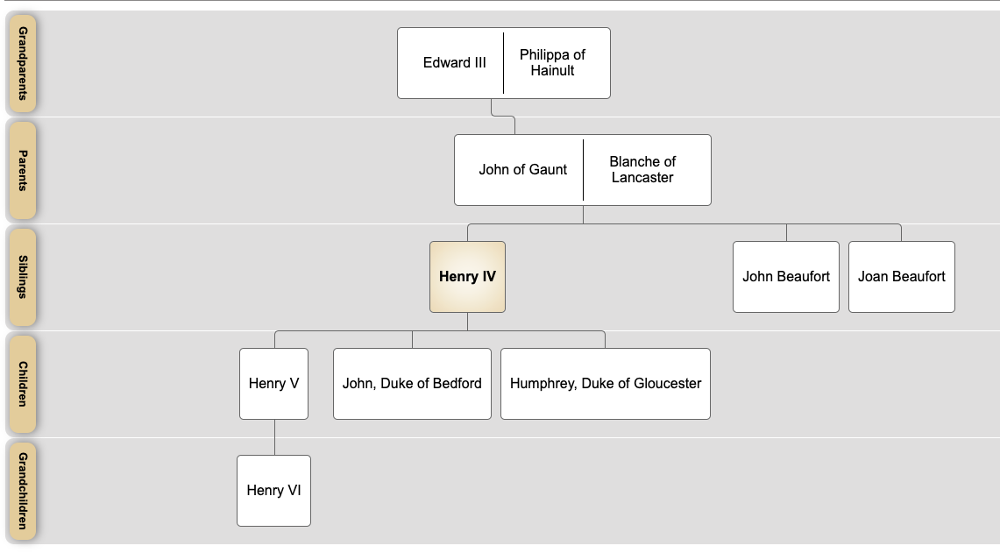
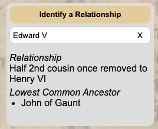

# Royal Familes
Royal Familes is a Rails app for tracking the family relationships of European medieval royalty. I built it becuase I wanted the challenge of dealing with a more complicated backend situation than I had previously. I wanted to be able to construct sophisticated queries for relationship types and lineage tracing. Along the way, I learned how to build something truly dynamic with CSS (a family tree) and created my own [JS autocomplete wiget.](https://github.com/mathpianop/autocomplete-select)
## Current Features
1. Each person in the database has an auto-generated CSS family tree that spans up to 5 generations, as well as a list of ancestors and descendants.


<br>

2. On each person's page, there is a section for finding distant relationships with other people (e.g., Edward V to Henry VI of England, half second cousins once removed).


## Planned Features

1. Each person will have a House attribute (i.e., royal house). Each House will have a Person who is its Head. The Heads of Houses will hold various Titles (e.g., Duke of Normandy, King of England). The Heads of Houses and holders of titles will have succesors and predecessors.
2. Given two people, one of whom is a direct descendant of the other, a line of descent should be generated.

Essentially, the overlapping concepts of titular succesion, familial descent, and familial inheritance should be mapped in every way possible.

## Installation

First, clone the repository and install the necessary gems.

```bash
git clone git@github.com:mathpianop/royal-familes.git
cd choral-tracks-rails
bundle install
```
<br>

Then, create and migrate the database:

```bash
rails db:create && rails db:migrate
```
<br>

Start the rails console with `rails c` and create an admin account

```ruby
Admin.create(email: "<email>", password: "<passsword>")
```


## License

Choral Tracks is released under the [MIT License](https://opensource.org/licenses/MIT).